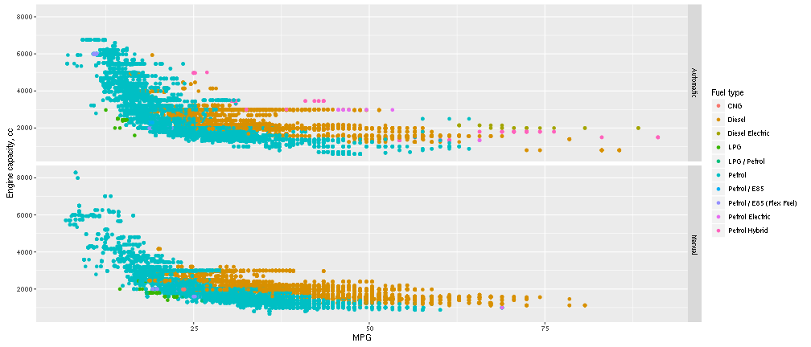

## Notes
* We used "Car fuel consumptions and emissions 2000-2013” dataset, all data can be found [here](http://data.okfn.org/data/amercader/car-fuel-and-emissions).
* Shiny app can be found [here](https://zaid.shinyapps.io/temp/).
* Github repository for this app: [link](https://github.com/ZaidAl-Matari/ZaidAl-Matari).
* Initial report: [link](https://zaidal-matari.github.io/index.html).


--- .class #id 

## Dataset cleaning


```r
fuelCons <- fuelCons %>%
  filter(combined_imperial < 100, transmission_type != "") %>%
  mutate(transmission_typeX = as.factor(ifelse(transmission_type == 'Manual',
                                               'Manual', 'Automatic'))) %>%
  mutate(particulates_emissions = as.numeric(as.character(particulates_emissions)))
```

---  .class #id 

## Histogram of overall MPG for all vecicles

```r
histMPG <- qplot(combined_imperial,
                 data = fuelCons,
                 binwidth = 3,
                 xlab = "Average MPG of urban and extra urban tests",
                 ylab = "Count of cars")
```


---  .class #id 

## Relations between engine capacity, MPG and other characteristics

